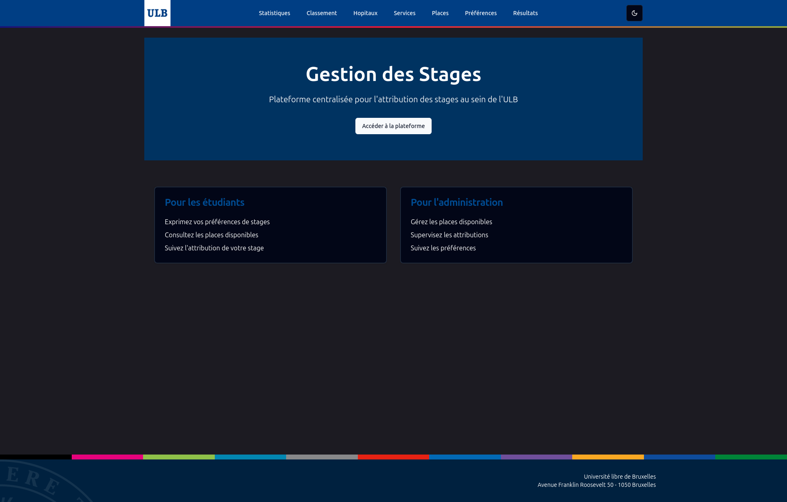

## Partie 3 : Conception d'une interface utilisateur responsive

### Consigne
Créez une interface utilisateur responsive pour présenter les différents éléments de l’API. 
L'accent est mis sur l'aspect convivial pour l'utilisateur (user-friendly) et l'interaction avec l'API.
Vous êtes libre d'utiliser le framework frontend et librairies tierces de votre choix.

### Compétences évaluées
- Conception d'interfaces utilisateur responsive.
- Expérience utilisateur (UX) et design d'interface (UI).
- Intégration et interaction avec une API backend.
- Maîtrise d'un framework frontend moderne.
- Qualité du code.

---

### Le projet

#### Prérequis
- npm v10.8.1
- node v20.16.0

#### Démarrage
`npm install` &&
`npm run dev`

##### Page d'accueil

##### Dark mode

##### Statistiques

##### Tableau

##### Liste

